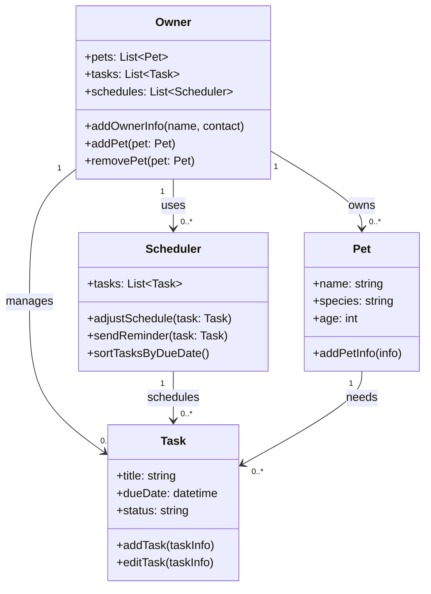

# PawPal+ Project Reflection

## 1. System Design

**a. Initial design**
    Three core actions that my app should do is let users is add a pet and themselves, add walks and/or any other aspects of their schedule, and add tasks. I would like to have a class dedicated to having pet information, schedule events and any tasks respectively. 
    Building blocks:
        Attritbutes:
        - Owners
        - Tasks
        - Pets
        - Schedules
        Methods:
        - Adding/editing tasks
        - Adding/removing pets to owners
        - Adding information about pets and owners
        - Adjusting the schedule with new tasks
        - Sending reminders about each task
        - Sorting tasks by due dates

**c. Mermaid class diagram**

**b. Design changes**

- Did your design change during implementation?
- If yes, describe at least one change and why you made it.
My design did not change much during implementation.

---

## 2. Scheduling Logic and Tradeoffs

**a. Constraints and priorities**

- What constraints does your scheduler consider (for example: time, priority, preferences)?
- How did you decide which constraints mattered most?

The constraints my scheduler considers is time and priority. I decided that these two matter the most, since when I plan events, I tend to rank them based off the time and priority. 

**b. Tradeoffs**

- Describe one tradeoff your scheduler makes.
- Why is that tradeoff reasonable for this scenario?
One trade off I made was not having anything related to preferences. I made this since I felt adding preferences would make this a lot more complicated than necessary, so keeping the priority and times was more realistic. I also made it so that all tasks required a time.

---

## 3. AI Collaboration

**a. How you used AI**

- How did you use AI tools during this project (for example: design brainstorming, debugging, refactoring)?
- What kinds of prompts or questions were most helpful?
I used AI to not only brainstrom, but debugging and helping refactor my code. The prompts I used that were the most helpful were often my most detailed ones
for example, "Help optimize method A in file.py to be at a much better time and space complexity, and explain why this method is better.". I also used AI to help optimize my code, having it come up with the best methods and explaining why they were better.

**b. Judgment and verification**

- Describe one moment where you did not accept an AI suggestion as-is.
- How did you evaluate or verify what the AI suggested?

One suggestion I did not accept was having both the Owners and Pets share a class. The reason why I did this was because AI was just blantanly wrong here. I evalated and verified this first by testing my code manually, then asking the AI to come up with much more complex tests. 

---

## 4. Testing and Verification

**a. What you tested**

- What behaviors did you test?
- Why were these tests important?

I tested tasks being marked as complete, verifying task count, priority, spacing, and recurrence of tasks. I knew that the Schedule and Task area would have the area with the most bugs, so having this be tested was pretty nice. 

**b. Confidence**

- How confident are you that your scheduler works correctly?
- What edge cases would you test next if you had more time?

I am confident that it works around 90% of the time.
I would test edge cases such as trying to assign one pet to multiple owners, and focus on that.

---

## 5. Reflection

**a. What went well**

- What part of this project are you most satisfied with?
I think the planning went well.

**b. What you would improve**

- If you had another iteration, what would you improve or redesign?
I would probably organize my code a bit more.
**c. Key takeaway**

- What is one important thing you learned about designing systems or working with AI on this project?
I learned that while AI is good at this, it still needs human review to do anything.